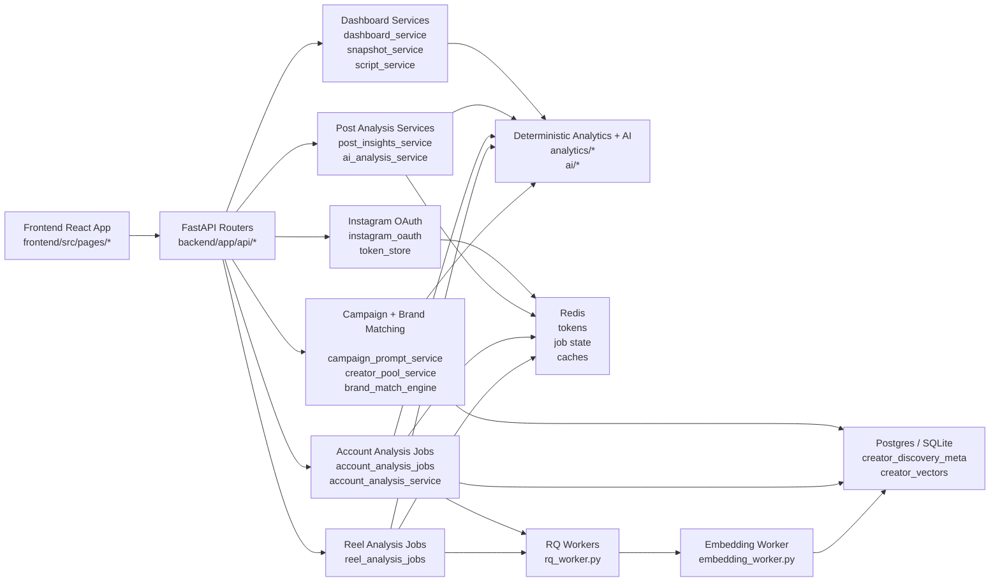
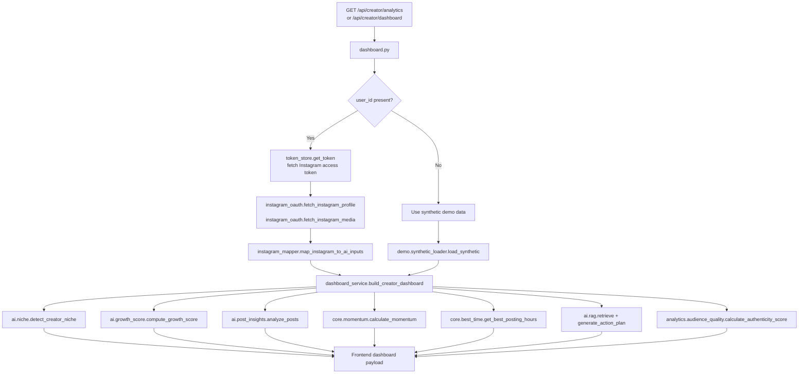
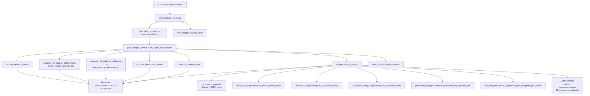
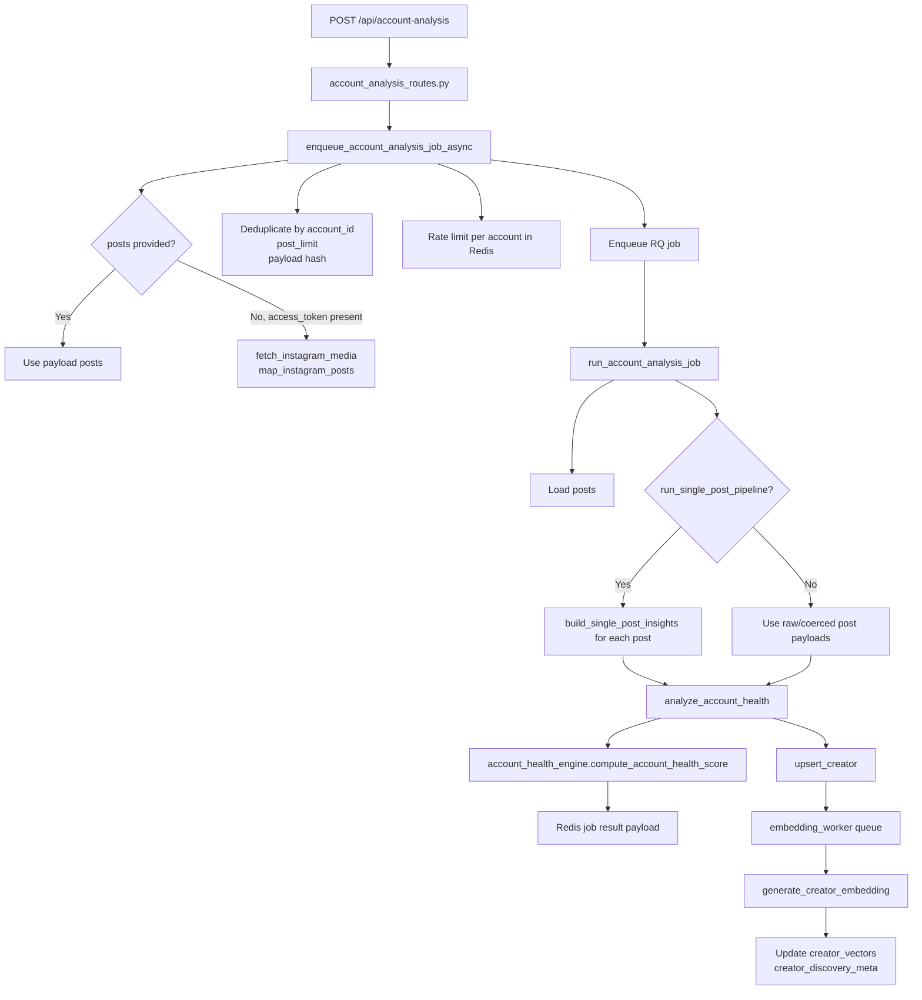
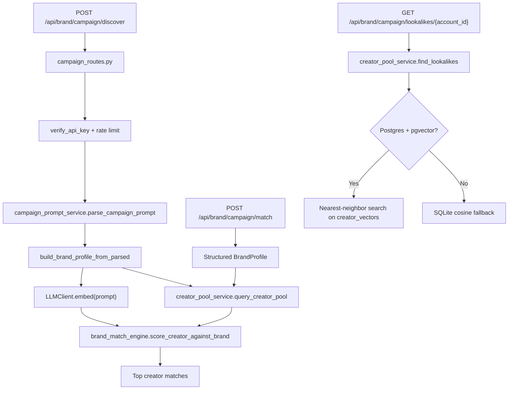
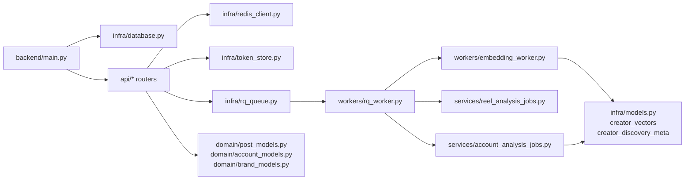

# Creonnect Actual Code Implementation Mind Map

This document is based on the current code implementation in the repository. It is intended to be copied into Confluence as an architecture and flow-reference page for backend, analytics, AI, queue, and frontend interactions.

## 1. Core Product Goal

Creonnect is a creator-intelligence platform with four main product jobs:

1. Build creator analytics dashboards from demo or Instagram OAuth data.
2. Analyze single posts and reels using deterministic metrics plus AI-assisted scoring.
3. Compute account-level health scores from post-level signals.
4. Match brands to creators using structured rules, embeddings, and creator-pool metadata.

The codebase is organized around those four jobs, with FastAPI routes exposing the product surface and services orchestrating deterministic analytics, AI, Redis, RQ, PostgreSQL/pgvector, and frontend responses.

## 2. Architecture Diagrams

The previous single-canvas mind map was too dense to read. This replacement uses a layered view:

- one system-level map
- four feature-flow diagrams
- one infrastructure/supporting-services map

### 2.1 System Map

### 2.2 Dashboard and Creator Analytics Flow

### 2.3 Single Post Analysis Flow

### 2.4 Account Analysis Job Flow

### 2.5 Brand Campaign and Matching Flow

### 2.6 Infrastructure and Support Map

## 3. FastAPI Router Map

| Router file | Endpoints | Input shape | Main service/engine path | Contribution to core task |
|---|---|---|---|---|
| `backend/app/api/dashboard.py` | `GET /api/creator/dashboard`, `GET /api/creator/analytics`, `GET /api/creators/{creator_id}/snapshot`, `POST /api/creators/{creator_id}/generate-script` | query `user_id` or path `creator_id` | `dashboard_service`, `snapshot_service`, `script_service` | Builds creator dashboard, summary analytics, action plans, snapshots, and script generation |
| `backend/app/api/post_analysis_routes.py` | `POST /api/v1/post-analysis`, `GET /api/v1/posts/{post_id}/cringe-summary`, `GET /api/v1/posts/{post_id}/insights` | full post payload including media URL, caption, engagement metrics, timestamps | `post_insights_service`, `ai_analysis_service`, Redis snapshot/cache helpers | Produces normalized post-level insight payload with S1-S6, weighted score, AI notes, and cringe summary |
| `backend/app/api/account_analysis_routes.py` | `POST /api/account-analysis`, `GET /api/account-analysis/{job_id}` | account metadata plus `posts` or `access_token`; supports rate and summary flags | `account_analysis_jobs`, `account_analysis_service` | Runs background account-health analysis and surfaces Redis-backed status/result |
| `backend/app/api/reel_analysis_routes.py` | `POST /api/reel-analysis/enqueue`, `GET /api/reel-analysis/jobs/{job_id}` | reel media URL, audio name, caption, watch time | `reel_analysis_jobs`, reel analytics engines | Runs async reel scoring workflow |
| `backend/app/api/brand_match_routes.py` | `POST /api/brand-match` | `BrandProfile` + list of `CreatorInput` | `brand_match_engine` | Scores arbitrary creator sets against a structured brand brief |
| `backend/app/api/campaign_routes.py` | `POST /api/brand/campaign/match`, `POST /api/brand/campaign/discover`, `GET /api/brand/campaign/lookalikes/{account_id}` | API key plus manual brand profile or free-text prompt | `campaign_prompt_service`, `creator_pool_service`, `brand_match_engine` | Creator discovery, prompt-to-brief extraction, pool filtering, top matches, and lookalikes |
| `backend/app/api/instagram_auth_routes.py` | `GET /api/auth/instagram/login`, `GET /api/auth/instagram/callback`, `GET /api/auth/me`, `POST /api/auth/logout` | OAuth `code`, `state`, session cookies | `instagram_oauth`, `token_store` | Connects real Instagram accounts and powers non-demo dashboard mode |

## 4. Service Map With Inputs, Outputs, and Responsibilities

### 4.1 Dashboard and Creator Intelligence

| Service/module | Accepts | Main downstream calls | Returns / writes | Why it exists |
|---|---|---|---|---|
| `backend/app/services/dashboard_service.py::build_creator_dashboard` | `creator_id`, optional `access_token` | `fetch_instagram_profile`, `fetch_instagram_media`, `map_instagram_to_ai_inputs`, `detect_creator_niche`, `compute_growth_score`, `analyze_posts`, `calculate_momentum`, `get_best_posting_hours`, `retrieve`, `generate_action_plan` | dashboard summary, posts, charts, authenticity analysis, action plan | Main creator analytics assembly layer |
| `backend/app/services/dashboard_service.py::build_creator_analytics` | same as above | calls `build_creator_dashboard` then account-health/content breakdown helpers | enriched analytics payload | Extends dashboard response for the frontend analytics page |
| `backend/app/services/snapshot_service.py` | `creator_id` | `load_synthetic`, `compute_growth_score`, `build_creator_snapshot` | daily creator snapshot | Lightweight snapshot endpoint |
| `backend/app/services/script_service.py` | `creator_id` | `load_synthetic`, `detect_creator_niche`, `generate_reel_script` | reel script object | Generates creator-tailored script ideas |

### 4.2 Single Post Insights

| Service/module | Accepts | Main downstream calls | Returns / writes | Why it exists |
|---|---|---|---|---|
| `backend/app/services/post_insights_service.py::build_single_post_insights` | target post, historical posts, AI flags | `compute_derived_metrics`, `compute_s2_caption_effectiveness`, `run_caption_analysis_llm`, `compute_s4_audience_relevance`, `run_audience_relevance_llm`, `compute_benchmark_metrics`, `compute_content_score`, `analyze_single_post_ai`, `write_post_insights_snapshot` | `SinglePostInsights`, deterministic content score, optional AI analysis | Main post pipeline orchestrator |
| `backend/app/services/ai_analysis_service.py::analyze_single_post_ai` | `SinglePostInsights`, optional `LLMClient` | `run_vision_analysis`, `compute_visual_quality_score`, `analyze_content_clarity_via_llm`, `compute_s6_brand_safety`, `compute_predicted_engagement_rate`, `compute_weighted_post_score`, LLM summary/driver/recommendation generation | AI result object with summary, drivers, recommendations, vision status, warnings, S5, weighted score | Adds multimodal and LLM-based intelligence on top of deterministic post metrics |
| `backend/app/services/post_snapshot_store.py` | post id, post payload, ai payload | Redis/local persistence helpers | cached snapshot | Makes post insights retrievable by post id after analysis |

### 4.3 Account-Level Analysis

| Service/module | Accepts | Main downstream calls | Returns / writes | Why it exists |
|---|---|---|---|---|
| `backend/app/services/account_analysis_jobs.py::enqueue_account_analysis_job_async` | payload with account info plus `posts` or `access_token` | media materialization, dedupe, rate limiting, RQ enqueue | queued `job_id` status | API-safe async enqueue path |
| `backend/app/services/account_analysis_jobs.py::run_account_analysis_job` | normalized queue payload | `_fetch_posts_from_source`, optional `build_single_post_insights`, `analyze_account_health`, `upsert_creator` | Redis job status/result, creator pool update | Main background account pipeline |
| `backend/app/services/account_analysis_service.py::analyze_account_health` | processed `SinglePostInsights` list, optional engagement and follower context | `compute_account_health_score` | `AccountHealthScore`, in-memory cached | Keeps account score calculation reusable and cacheable |
| `backend/app/analytics/account_health_engine.py::compute_account_health_score` | scored post list plus optional benchmark context | internal pillar calculators | AHS score, band, pillars, drivers, recommendations, metadata | Produces the account-level health model used across dashboards and discovery |

### 4.4 Reel Analysis

| Service/module | Accepts | Main downstream calls | Returns / writes | Why it exists |
|---|---|---|---|---|
| `backend/app/services/reel_analysis_jobs.py::enqueue_reel_analysis_job` | reel payload | RQ enqueue | queued `job_id` | Non-blocking reel analysis entrypoint |
| `backend/app/services/reel_analysis_jobs.py::run_reel_analysis_job` | normalized reel payload | `run_reel_gemini_analysis`, `compute_reel_audio_score`, `compute_reel_analysis` | Redis job status/result | Turns raw reel media and metadata into a stored reel-analysis result |

### 4.5 Brand Matching and Campaign Discovery

| Service/module | Accepts | Main downstream calls | Returns / writes | Why it exists |
|---|---|---|---|---|
| `backend/app/services/campaign_prompt_service.py::parse_campaign_prompt` | natural language campaign prompt, optional brand name | `LLMClient.generate`, TOON parse, regex fallback | loose parsed campaign dict | Converts text briefs into structured matching requirements |
| `backend/app/services/campaign_prompt_service.py::build_brand_profile_from_parsed` | parsed brief dict | `BrandProfile` validation | validated `BrandProfile` | Normalizes prompt output into contract-safe profile |
| `backend/app/services/creator_pool_service.py::query_creator_pool` | niche and follower filters | SQLAlchemy query on discovery tables | creator candidate list | Retrieves match candidates from stored creator pool |
| `backend/app/services/creator_pool_service.py::find_lookalikes` | `account_id`, optional `k` | pgvector similarity query or sqlite cosine fallback | nearest creator list | Powers creator lookalike search |
| `backend/app/analytics/brand_match_engine.py::score_creator_against_brand` | brand profile plus aggregated creator signals | internal component scoring logic | `CreatorMatchScore` | Central ranking logic for direct brand matching and campaign discovery |

### 4.6 Instagram OAuth and Ingestion

| Service/module | Accepts | Main downstream calls | Returns / writes | Why it exists |
|---|---|---|---|---|
| `backend/app/ingestion/instagram_oauth.py` | OAuth `code`, access token, fetch limits | Meta Graph API requests | OAuth URL, tokens, profile payload, media payload | Entry point for real Instagram data |
| `backend/app/ingestion/instagram_mapper.py` | raw Instagram profile/media JSON | Pydantic model mapping | `CreatorProfileAIInput`, `CreatorPostAIInput`, legacy dicts | Converts external API shapes into internal AI/analytics inputs |
| `backend/app/infra/token_store.py` | `user_id`, token payload | Redis + Fernet encryption | encrypted token read/write/delete | Persists OAuth credentials securely enough for local/product use |

## 5. Analytics and AI Scoring Layers

### 5.1 Post-Level Scoring Stack

| Module | Accepts | Produces | Used by |
|---|---|---|---|
| `backend/app/analytics/derived_metrics.py` | `CoreMetrics` | engagement rate, save/share rates, total engagements, related ratios | post insights pipeline |
| `backend/app/analytics/benchmark_engine.py` | target post + history | account averages, percentile rank, percent-vs-average metrics | post insights pipeline |
| `backend/app/analytics/content_score.py` | derived metrics + benchmark metrics | deterministic content score and band | post insights + AI prompt context |
| `backend/app/analytics/caption_s2_engine.py` | caption text | S2 caption effectiveness score | post insights pipeline |
| `backend/app/analytics/vision_s1_engine.py` | normalized vision payload | S1 visual quality score | AI analysis service |
| `backend/app/analytics/vision_s3_engine.py` | caption text + vision signals | S3 content clarity score | AI analysis service |
| `backend/app/analytics/s4_audience_relevance_engine.py` | creator category + post category | S4 audience relevance score | post insights and AI analysis |
| `backend/app/analytics/s6_brand_safety_engine.py` | brand context + vision signal | S6 brand safety score | AI analysis service |
| `backend/app/analytics/predicted_er_engine.py` | deterministic post metrics | predicted engagement rate | AI analysis service and matching |
| `backend/app/analytics/post_weighted_score_engine.py` | S1-S6 + media type | weighted post score `P` | AI analysis output |

### 5.2 Account-Level Scoring Stack

| Module | Accepts | Produces | Used by |
|---|---|---|---|
| `backend/app/analytics/account_health_engine.py` | processed `SinglePostInsights` list and optional benchmark context | AHS score, band, pillars, drivers, recommendations | account analysis service |
| `backend/app/analytics/niche_benchmark_engine.py` | follower and niche context | niche benchmark commentary | upstream niche/account scoring contexts |
| `backend/app/analytics/audience_quality.py` | follower, views, likes, comments | authenticity score | dashboard and embedding refresh |

### 5.3 AI Helpers

| Module | Accepts | Produces | Used by |
|---|---|---|---|
| `backend/app/ai/llm_client.py` | text prompts or embedding text | generated text or embeddings | campaign parsing, summary generation, creator embeddings |
| `backend/app/ai/niche.py` | profile + posts | niche prediction | dashboard and script generation |
| `backend/app/ai/growth_score.py` | profile + posts | growth score and metrics | dashboard and snapshot service |
| `backend/app/ai/post_insights.py` | profile + posts | human-readable per-post insight summaries | dashboard service |
| `backend/app/ai/rag.py` | query text + knowledge base | retrieved chunks and action plan | dashboard action plan generation |
| `backend/app/ai/cringe_analysis.py` | vision payload | cringe label/risk section | post analysis route and brand safety reporting |

## 6. Background Infrastructure and Persistence

| Layer | Files | Role in system |
|---|---|---|
| Redis JSON/text helpers | `backend/app/infra/redis_client.py` | Shared persistence for job state, short-lived caches, dedupe keys, counters, and some token storage interactions |
| RQ queue abstraction | `backend/app/infra/rq_queue.py` | Standard queue names, timeouts, result TTLs, failure TTLs |
| Worker boot | `backend/app/workers/rq_worker.py` | Starts `account-analysis` and `embedding-ingestion` workers; imports jobs so RQ can resolve callables |
| SQLAlchemy engine setup | `backend/app/infra/database.py` | Creates async/sync DB engines, sessionmakers, and table initialization |
| Discovery tables | `backend/app/infra/models.py` | Stores creator vectors and creator discovery metadata; enables pgvector/HNSW lookalike search |
| Embedding refresh | `backend/app/workers/embedding_worker.py` | Upserts discovery metadata, generates embeddings, updates authenticity score, enqueues embedding jobs |

## 7. Frontend to Backend Wiring

| Frontend page | Calls | Backend responsibility |
|---|---|---|
| `frontend/src/pages/Dashboard.jsx` | `GET /api/creator/analytics` | full creator analytics payload with dashboard summary, posts, account health, charts, and action plan |
| `frontend/src/pages/BrandCampaign.jsx` | `POST /api/brand/campaign/discover`, `POST /api/brand/campaign/match`, `GET /api/brand/campaign/lookalikes/{account_id}` | campaign brief parsing, creator pool filtering, scoring, and semantic lookalikes |
| `frontend/src/pages/SinglePostInsights.jsx` | `GET /api/v1/posts/{media_id}/insights` | cached post insight payload returned after post analysis has been run |
| `frontend/src/pages/Callback.jsx` | `GET /api/auth/instagram/callback` | finishes Instagram OAuth, stores user identity, enables real-data dashboard mode |

## 8. Primary Runtime Flows

### 8.1 Creator Dashboard Flow

1. Frontend requests `/api/creator/analytics`.
2. `dashboard.py` checks for `user_id`.
3. If `user_id` is present, token is loaded from Redis-backed token store.
4. `dashboard_service.build_creator_analytics()` fetches Instagram profile/media or falls back to synthetic demo data.
5. Service computes niche, growth, post summaries, momentum, best-time suggestions, authenticity, and RAG action plan.
6. Response is returned in a chart-ready format for the dashboard page.

### 8.2 Single Post Analysis Flow

1. Caller posts a raw single-post payload to `/api/v1/post-analysis`.
2. Route normalizes payload into `CreatorPostAIInput`.
3. `post_insights_service.build_single_post_insights()` computes deterministic metrics first.
4. `ai_analysis_service.analyze_single_post_ai()` runs Gemini vision and LLM-based enrichment if available.
5. Post insight snapshot and cringe summary are cached.
6. Client later fetches `/api/v1/posts/{post_id}/insights` or `/cringe-summary`.

### 8.3 Account Analysis Job Flow

1. Caller posts account payload to `/api/account-analysis`.
2. `account_analysis_jobs` materializes posts from payload or from Instagram media via access token.
3. Job dedupe and per-account rate limiting are enforced in Redis.
4. RQ worker runs `run_account_analysis_job`.
5. Optional post-by-post insight pipeline enriches each post.
6. `analyze_account_health()` computes AHS result from processed posts.
7. Result is written to Redis status payload.
8. Creator metadata is upserted into discovery tables and embedding generation is queued.

### 8.4 Campaign Discovery Flow

1. Frontend posts prompt to `/api/brand/campaign/discover`.
2. `campaign_prompt_service` converts prompt into parsed brief and validated `BrandProfile`.
3. `LLMClient.embed()` creates a brand search embedding.
4. `creator_pool_service.query_creator_pool()` pulls filtered candidates from DB.
5. `brand_match_engine.score_creator_against_brand()` ranks candidates.
6. Response returns top matches, parsed brief, and explanation summary.

### 8.5 Lookalike Flow

1. Frontend requests `/api/brand/campaign/lookalikes/{account_id}`.
2. `creator_pool_service.find_lookalikes()` checks stored embedding for target creator.
3. PostgreSQL path uses pgvector nearest-neighbor search.
4. SQLite fallback computes cosine similarity in Python.
5. Matching creator metadata is returned to the UI.

## 9. Important Data Contracts

### 9.1 `BrandProfile`

Accepted by direct brand matching and campaign discovery logic.

- `brand_name`
- `niche`
- `min_followers`
- `max_followers`
- `min_engagement_rate`
- `required_brand_safety_min`
- `content_quality_min`

### 9.2 `SinglePostInsights`

Canonical post-analysis object used across deterministic analytics and AI services.

Major sections:

- identity: `account_id`, `media_id`, `media_type`, `media_url`, `published_at`
- raw metrics: `core_metrics`
- derived metrics: `derived_metrics`
- historical benchmarks: `benchmark_metrics`
- stage scores: visual, caption, clarity, audience relevance, engagement potential, brand safety
- weighted score and predicted engagement rate
- optional `vision_analysis`

### 9.3 `AccountHealthScore`

Returned by account analysis logic.

- `ahs_score`
- `ahs_band`
- `pillars`
- `drivers`
- `recommendations`
- `metadata`

## 10. Confluence Notes

For Confluence, this page works best if copied in this order:

1. Section 1 and Section 2 for executive architecture context.
2. Section 3 and Section 4 for implementation ownership mapping.
3. Section 8 for end-to-end runtime explanations.

If the Confluence Mermaid macro does not support `mindmap`, convert Section 2 into a standard flowchart or paste Sections 3 to 8 as the primary reference tables.
