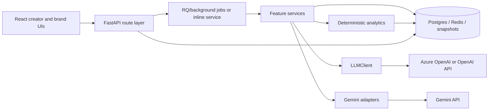
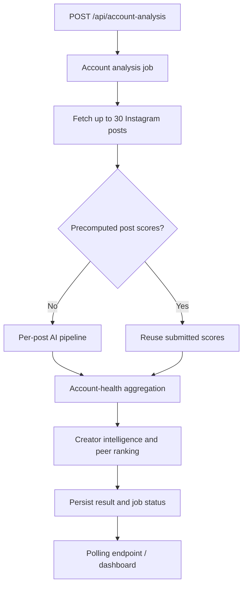
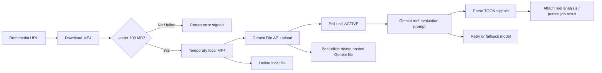
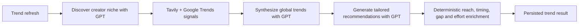
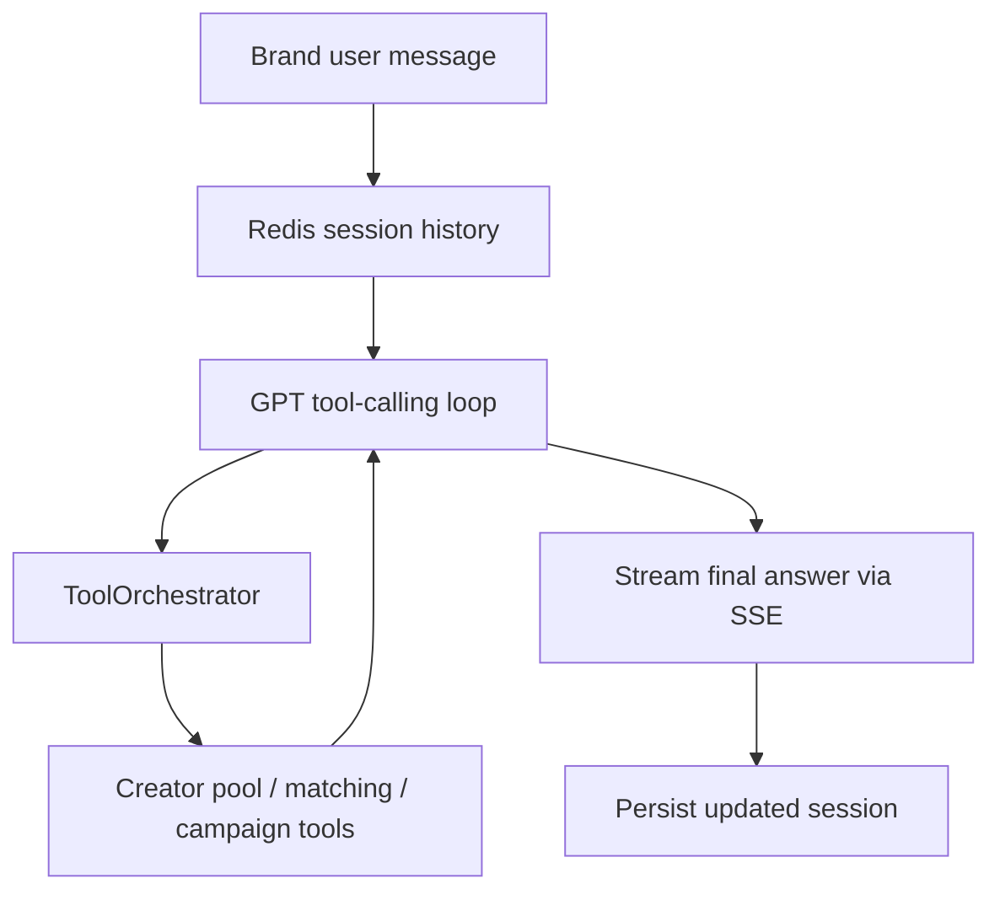

# AI Feature Architecture

**Purpose:** production map of Creonnect’s AI-backed product features, including the data paths, model boundaries, persistence, and fallback behavior.  
**Scope:** current code under `backend/app/` and the React UI under `frontend/src/`. This document describes runtime behavior; it is not a future-state proposal.

## 1. System overview

Creonnect is deliberately hybrid: models generate unstructured or structured interpretation, while scoring, ranking, validation, persistence, and most recommendations remain deterministic. A model failure should produce degraded or fallback output rather than inventing results.

## 2. Shared AI platform

| Component | Responsibility | Main files |
|---|---|---|
| API layer | Authentication, validation, rate limits, job enqueue/poll endpoints | `backend/app/api/` |
| `LLMClient` | Shared Chat Completions, tool calling, embeddings, timeout/retry, circuit breaker | `backend/app/ai/llm_client.py` |
| Gemini adapters | Image/video analysis and Gemini image editing | `backend/app/services/ai_analysis_service.py`, `backend/app/analytics/reel_gemini_engine.py`, `backend/app/services/image_editor_ai_service.py` |
| Analytics engines | Deterministic calculations and output validation | `backend/app/analytics/` |
| Domain models | Pydantic payload contracts between API, services, and UI | `backend/app/domain/` |
| Persistence | Postgres records, Redis job/session state, post snapshots, account results | `backend/app/infra/`, `backend/app/services/*_store.py` |
| Workers | Long-running account, post, trend, and idea work | `backend/app/services/*_jobs.py`, `backend/app/workers/` |

### Provider routing

`LLMClient` defaults to `gpt-4o-mini`. If `AZURE_OPENAI_ENDPOINT` is configured it sends text and embedding requests to the configured Azure deployment; otherwise it uses the direct OpenAI API. `LLM_MODEL_NAME` can override the text-model name.

Gemini is used for native visual understanding. Current source constants use `gemini-2.5-flash-lite`; the planned production replacement is `gemini-3.1-flash-lite` before the October 2026 retirement. `GEMINI_MODEL` can override the selected Gemini model.

The image editor has isolated provider configuration. GPT Image calls use a dedicated Azure deployment, while Gemini image edits use `IMAGE_EDITOR_GEMINI_MODEL`; neither should inherit a text-model deployment accidentally.

### Terms used in this document

- **TOON (Token-Oriented Object Notation):** the project’s compact, YAML-like structured text format. Model outputs are parsed and validated into domain models before use.
- **Degraded result:** a successful API response that contains explicitly limited, cached, or deterministic fallback data rather than a complete model-derived result.

## 3. Creator analysis

### 3.1 Account AI Analysis

**User outcome:** an account-health score, creator intelligence, peer rankings, per-post summaries, and deterministic recommendations.

The account endpoint is asynchronous and defaults to 30 posts (maximum 30). It deduplicates matching requests for two hours and limits an account to three requests per hour.

**Per-post AI pipeline** (`post_insights_service.py` → `ai_analysis_service.py`):

1. Calculates derived metrics, benchmarks, and deterministic content score.
2. Runs Gemini vision for image posts where configured.
3. Runs GPT text scoring for S2 caption effectiveness, S3 content clarity, S4 audience relevance, and the creator-facing post summary.
4. Calculates visual quality, brand safety, engagement potential, weighted score, and predicted engagement rate deterministically from validated model output.
5. Writes a post snapshot for reuse.

The account job then adds GPT-based creator intelligence and optional peer rankings. Account-health scoring, creator intelligence reports, and action plans use deterministic models around these outputs.

**Key files:** `account_analysis_routes.py`, `account_analysis_jobs.py`, `post_insights_service.py`, `ai_analysis_service.py`, `account_health_engine.py`, `account_ai_intelligence.py`, `peer_ranking_engine.py`.

### 3.2 Single-Post AI Analysis

**User outcome:** a detailed quality breakdown, visual signals, caption and clarity scores, content recommendations, and predicted engagement.

`POST /api/v1/single-post-analysis` queues a job through `single_post_analysis_jobs.py`; an inline compatibility path is also available. Both call the same `build_single_post_insights(..., run_ai=True)` service, so there is one canonical scoring path.

For media with a valid URL, Gemini vision returns a constrained structured payload. The service validates and normalizes it before deterministic engines use it. If Gemini fails, image posts may fall back to OpenAI vision. If the final LLM result is invalid or unavailable, the service returns deterministic recommendations and marks the result as degraded/fallback.

**Reel note:** the account pipeline additionally runs `reel_gemini_engine.py`, which uploads the video to Gemini File API and derives reel signals. The standalone single-post path does not currently attach this File API reel analysis.

### 3.3 Reel Gemini engine

**User outcome:** reel-specific visual signals used to derive pacing, hook, and reel-analysis feedback for account and dedicated reel-analysis jobs.

`reel_gemini_engine.py` is a distinct video path; it does not reuse the image-only Gemini vision request. It is invoked by `account_analysis_post_pipeline.py` when an account-analysis post has `media_type=REEL`, and by `reel_analysis_jobs.py` for dedicated reel work.

The engine accepts only a configured `GEMINI_API_KEY`, downloads at most 100 MB with a 30-second download timeout, uploads an MP4 through Gemini File API, and polls file state for up to 20 attempts at two-second intervals. It evaluates the active file using the primary Gemini model, then the fallback model. Each model receives at most one retry only for provider rate-limit/resource-exhausted errors, so a failing request can make up to four generation attempts.

It parses TOON into a signal payload and always attempts local temporary-file cleanup and Gemini-hosted file deletion. It returns `ok`, `error`, or `disabled` rather than raising provider failures into the account pipeline; account analysis treats an error as non-fatal and continues with the rest of the post/account result.

**Key files:** `reel_gemini_engine.py`, `reel_analysis_jobs.py`, `account_analysis_post_pipeline.py`, `account_analysis_jobs.py`, `reel_analysis_service.py`, `reel_audio_engine.py`.

### 3.4 Draft optimizer

**User outcome:** optimized caption options, predicted reach band, posting-time suggestions, safety flags, and optional draft visual feedback.

`POST /api/draft-analysis` loads account history, serializes up to 12 historical posts, optionally runs the shared vision service on the draft media, then asks GPT for strict TOON (Token-Oriented Object Notation) output. Invalid or failed responses return a safe fallback with the visual analysis retained when available.

**Key files:** `draft_analysis_routes.py`, `draft_optimizer_engine.py`.

## 4. Trends, ideas, scripts, and captions

### 4.1 Trend recommendations

**User outcome:** creator-specific live trends, recommendations, content gaps, daily insights, and weekly opportunities.

Trend jobs use `CreatorTrendService` to orchestrate three model stages: niche discovery, global-trend synthesis grounded in live signals, and recommendation generation. Tavily and Google Trends are evidence sources; they are not model providers. If live signals or model output are unavailable, the feature returns an explicitly degraded/fallback result rather than fabricated trends.

**Key files:** `trend_routes.py`, `trend_analysis_jobs.py`, `creator_trend_service.py`, `niche_discovery_engine.py`, `global_trend_engine.py`, `trend_recommendation_engine.py`, `trend_signals_fetcher.py`.

### 4.2 Idea management and content generation

**User outcome:** generated ideas plus on-demand improvements, variations, regenerated ideas, scripts, captions, thumbnail prompts, and a lightweight trend assistant.

`content_suggestion_routes.py` accepts user actions and queues durable jobs in `content_suggestion_jobs.py`. The job stores state and results in the database, allowing the UI to poll rather than hold a web request open. GPT responses are requested as JSON and parsed before fields are persisted.

This area includes these AI actions:

| Action | Service | Persistence/fallback |
|---|---|---|
| Idea generation | `_generate_ideas_with_llm` | Stores generated ideas; emits basic fallback ideas on failure |
| Improve/regenerate/variations | `run_idea_*` jobs | Updates the source idea or its variation list; fails the job on invalid output |
| Script generation | `script_generator.py` | Returns generated script text |
| Caption generation | `caption_generator.py` | Returns generated caption text |
| Thumbnail concepts | `content_suggestion_routes.py` | No model call and no persistence: returns four deterministic prompt concepts with `status=concept_only` and no image URL |
| Trend AI assistant | Route-level LLM call | Returns a bounded assistant reply or a 503 error |

## 5. Brand intelligence

### 5.1 Campaign discovery and matching

**User outcome:** structured brand briefs, creator matches, discovery results, and summaries.

The campaign route uses `campaign_prompt_service.py` to parse natural-language briefs into a validated `BrandProfile`. It then runs deterministic creator-pool filtering and `brand_match_engine.py` scoring. The LLM is used for interpretation and human-readable summaries, not as the source of creator facts.

Creator discovery and lookalikes use stored creator data and embeddings. `text-embedding-3-small` creates vectors for semantic matching; the configured vector dimension must remain compatible with the stored index.

### 5.2 Brand chat and Creo Intelligence

**User outcome:** interactive campaign planning, creator discovery, outreach, briefs, campaign reviews, budget allocation, and benchmarking.

`brand_chat_service.py` runs a bounded tool loop. `creo_intelligence_service.py` expands this into multi-turn SSE streaming with Redis-backed conversation history. Both constrain tool use using schemas and a maximum iteration count; tools supply the evidence before a final model answer is produced.

**Key files:** `campaign_routes.py`, `campaign_prompt_service.py`, `brand_chat_service.py`, `creo_intelligence_routes.py`, `creo_intelligence_service.py`, `tool_orchestrator.py`, `tool_schemas.py`, `creator_pool_service.py`.

## 6. AI image editor

**User outcome:** catalog-filter or freeform image transformations with a preserved record of the generated edit.

The image editor has two distinct modes:

- **Deterministic filters:** server-side image processing; no model call.
- **AI edit mode:** validates the request, compiles a server-controlled prompt, rejects protected-IP prompts, then calls either the Azure GPT Image deployment or the configured Gemini image model.

Original assets, edit records, and background job status are persisted. The server—not the browser—constructs catalog prompts and enforces the protected-IP restriction. Generation errors are returned as failed job/endpoint responses; no synthetic image is substituted.

**Key files:** `image_editor_routes.py`, `image_editor_ai_service.py`, `image_editor_provider_config.py`, `image_editor_config_service.py`, `domain/image_editor_models.py`.

## 7. State, resiliency, and safeguards

| Concern | Current mechanism |
|---|---|
| Input validation | Pydantic API/domain models; bounded text/media checks; model-output parsers |
| Authentication | Instagram-session dependency for creator routes; API-key checks on selected routes |
| Model availability | `AI_EXTERNAL_CALLS_ENABLED`, OpenAI/Gemini key checks, provider-specific configuration validation |
| Failure behavior | Deterministic fallbacks, degraded status/warnings, or explicit job failure depending on feature |
| Retry control | `LLMClient` bounded retry/backoff and circuit breaker; Gemini vision simplified-prompt retry; bounded tool iterations |
| Job durability | Redis job state for long-running tasks; Postgres for account results, ideas, assets, and persisted feature data |
| Duplicate work | Account request dedupe, post snapshots, account-analysis result caching, and trend result storage |
| Prompt safety | Server-side prompt compilation for image edits; brand prompt sanitization; schema-constrained outputs |

### Request-level cost controls

| Feature | Implemented control | Current gap or behavior |
|---|---|---|
| Account analysis | Three requests per account per hour; two-hour duplicate-request window | Rate limit constrains bursts; it is not a dollar budget |
| Trend refresh | Default three requests per account per 30 minutes; Redis-backed 24-hour content-hash cache | If Redis is unavailable, refresh continues in a degraded mode without the rate limit/cache |
| Single-post analysis | Authentication and queued job execution | No feature-specific request throttle found in the route/job path |
| Draft optimizer | Authentication and required historical context | No feature-specific request throttle found in the route path |
| AI image edit | Authenticated asset ownership, input validation, provider configuration checks | No feature-specific request throttle found in the route path; provider failure returns 502 |
| Ideas/scripts/captions | Durable background jobs for most actions | No common feature-credit or request-budget enforcement found in this path |

### Operations visibility

Provider failures, retries, and circuit-breaker state transitions are logged. Selected features emit counters and timings (for example trend and TOON-parse events), but circuit-breaker trips, retry exhaustion, provider token usage, and per-feature dollar cost are not currently emitted as dedicated metrics or alerts. These need telemetry and alerting before free-credit limits can be enforced reliably.

## 8. Operational configuration

| Configuration | Controls |
|---|---|
| `OPENAI_API_KEY` | Direct OpenAI access when Azure is not configured |
| `AZURE_OPENAI_ENDPOINT`, `AZURE_OPENAI_API_KEY`, `AZURE_OPENAI_API_VERSION` | Text/embedding Azure OpenAI path |
| `LLM_MODEL_NAME` | Text model/deployment name; default is `gpt-4o-mini` |
| `GEMINI_API_KEY`, `GEMINI_MODEL` | Gemini vision and reel analysis |
| `AI_EXTERNAL_CALLS_ENABLED` | Global switch for external analysis calls |
| `AI_PEER_RANKINGS_ENABLED` | Enables GPT-backed peer rankings |
| `IMAGE_EDITOR_AZURE_OPENAI_*` | Dedicated Azure GPT Image deployment |
| `IMAGE_EDITOR_GEMINI_API_KEY`, `IMAGE_EDITOR_GEMINI_MODEL` | Gemini image-edit alternative |
| `TAVILY_API_KEY` | Live evidence for trend recommendations |

## 9. Current architecture decisions and known follow-ups

1. Migrate Gemini runtime constants and deployment configuration from 2.5 Flash-Lite to 3.1 Flash-Lite before the planned October 2026 retirement; update regression tests at the same time.
2. Add per-call provider usage telemetry (feature, model, input/output/cached tokens, media type, retry, estimated cost). See `AI_FEATURE_COST_MODEL.md`.
3. Make the OpenAI image-vision fallback model explicit. Its local fallback default is `gpt-4o` if `LLM_MODEL_NAME` is unset, which is inconsistent with the intended GPT-4o mini cost posture.
4. Decide whether standalone Reel analysis should include the Gemini File API stage used by account analysis.
5. Keep asynchronous work on workers; use Batch APIs only for intentionally deferred workloads, not interactive dashboards.
6. Set task-specific output caps for S2, S3, and S4. They currently inherit the generic 1,200-token cap despite needing substantially smaller structured outputs.
7. Keep the existing 24-hour trend cache, and add cache-hit/bypass telemetry so forced refresh behavior and cache effectiveness are visible in production.
8. Add feature-level throttles and a credit-budget check for single-post analysis, draft optimization, AI image edits, and content generation before launching free credits.

## 10. Related documents

- `docs/AI_FEATURE_COST_MODEL.md` — pricing, token assumptions, batch/caching options
- `docs/ai_analysis_architecture.md` — earlier single-post analysis detail
- `docs/creator_trend_recommendation_architecture.md` — trend-specific detail
- `docs/Creator_discovery_architecture.md` — creator pool and embeddings
- `docs/CREONNECT_AI_GUARDRAILS.md` — AI guardrails and policy context
