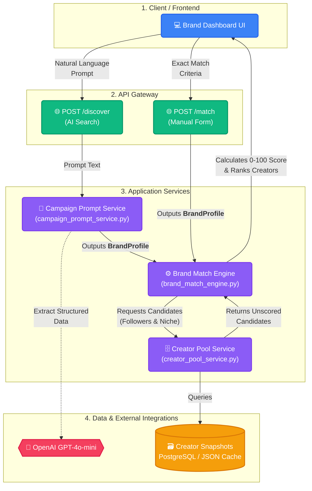

# Brand Side Architecture

This document outlines the architecture, data flow, and components of the Brand Campaign & Creator Matching system.

## Overview

The brand side allows brands to discover and match with creators from the platform's analyzed creator pool. Brands can define their ideal creator through natural language (AI Discovery) or by filling out a strict criteria profile (Manual Match). The system scores the creator pool against these requirements and returns the top ranked matches.

---

##  Architecture Flow

---

##  Core Components & Responsibilities

| Layer | File / Module | Responsibility |
|---|---|---|
| **API Routers** | `backend/app/api/campaign_routes.py` `backend/app/api/brand_match_routes.py` | FastAPI endpoints for handling HTTP requests. Validates incoming payloads and returns the final JSON responses. |
| **AI Parser (LLM)** | `backend/app/services/campaign_prompt_service.py` | Parses natural language prompts into a structured `BrandProfile` using OpenAI's models. This is the **only** place the LLM is used in the matching flow. |
| **Data Retrieval** | `backend/app/services/creator_pool_service.py` | Acts as the data access layer. Given baseline requirements (follower range, niche), queries the database to retrieve a subset of eligible creator candidates. |
| **Scoring Engine** | `backend/app/analytics/brand_match_engine.py` | Pure deterministic Python logic. Takes a list of creators, calculates their `total_match_score` (0-100) based on 5 pillars, and flags any disqualifications. |
| **Domain Models** | `backend/app/domain/brand_models.py` | Pydantic models defining `BrandProfile` and `CreatorMatchScore` structures for safe data validation across operations. |

---

##  How Scoring Works (The Math)

The `brand_match_engine.py` evaluates every creator candidate against the `BrandProfile` across 5 pillars, each worth a maximum of 20 points.

1. **Niche Fit (0-20)**
   - Exact category match: 20 pts
   - Partial/keyword overlap: 12 pts
   - Unknown category: 8 pts
   - Complete mismatch: 3 pts

2. **Audience Size Fit (0-20)**
   - Falls within requested min/max range: 20 pts
   - Within 2x of range: 12 pts
   - Within 5x of range: 6 pts
   - Greater mismatch: 2 pts

3. **Engagement Quality (0-20)**
   - Based on the creator's Account Health Score (AHS) scaled to 15.
   - Bonus points (+1 to +5) awarded if the creator's predicted engagement rate is unusually high (e.g., >5%).

4. **Brand Safety Fit (0-20)**
   - Scales the creator's S6 Brand Safety Score (0-50) linearly to 20 points.

5. **Content Quality (0-20)**
   - Scales the creator's S1 Visual Quality Score (0-50) linearly to 20 points.

###  Hard Disqualifications
A creator is scored as `0` and explicitly rejected if:
- They contain flagged adult content.
- Their brand safety score falls below the brand's `required_brand_safety_min`.
- Their engagement rate falls below the brand's `min_engagement_rate`.

---

##  Missing Pieces for Production

To take this flow to production, the backend team needs to update the **Database Layer**.

Currently, `query_creator_pool()` loads a mocked JSON file (`demo/creator_pool.json`). This needs to be replaced with a live SQL query against the creator database. 

**Required SQL Data Needs:**
To successfully score a creator, the engine needs just 8 fields from the creator snapshots:
1. `account_id`
2. `follower_count`
3. `creator_dominant_category`
4. `ahs_score`
5. `avg_visual_quality_score` (S1)
6. `avg_brand_safety_score` (S6)
7. `predicted_engagement_rate`
8. `adult_content_detected` (Boolean)
