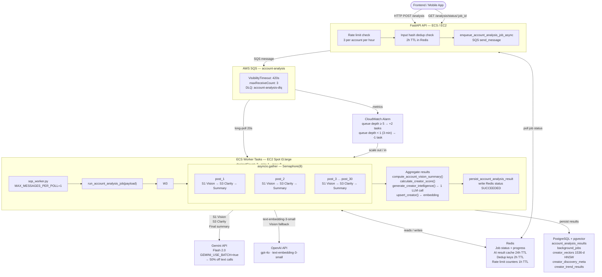

# ECS + Async Fan-out — Detailed Architecture

> **Creonnect AI Analysis Pipeline**  
> Last updated: 2026-06-28

---

## Architecture Diagram


---

## Full Flow Diagram



---

## Component Detail

### FastAPI API

| Concern | Implementation |
|---|---|
| Transport | uvicorn, HTTP 8000 + gRPC 50051 |
| Rate limiting | Redis counter — `account_analysis:rate:{account_id}`, 3/hour, 1h TTL |
| Deduplication | Input hash stored at `account_analysis:dedupe:{account_id}`, 2h TTL |
| Enqueue | `SQS.send_message` with `{"job_name": "account_analysis", "payload": {...}}` |
| Status polling | Reads `account_analysis:job:{job_id}` from Redis |

---

### AWS SQS

| Property | Value | Why |
|---|---|---|
| Type | Standard Queue | Order not required |
| `VisibilityTimeout` | 420s | Safely above P95 job time (~3 min) |
| `maxReceiveCount` | 3 | 3 failures → moves to DLQ |
| DLQ | `account-analysis-dlq` | 14-day retention for inspection |
| `WaitTimeSeconds` | 20 | Long-poll — reduces empty receive calls |
| `MaxNumberOfMessages` | 1 | One job per worker poll |

**Other queues (same DLQ pattern):** `single-post-analysis`, `embedding-ingestion`, `reel-analysis`

---

### ECS Worker — sqs_worker.py

```
Poll SQS (long-poll, 20s)
  └─ Receive message
       ├─ Decode: { job_name, payload, job_id }
       ├─ Dispatch to registered handler
       │     └─ run_account_analysis_job(payload)
       └─ [finally] delete_message  ← always, even on failure
```

**Handlers registered:**

| job_name | Handler |
|---|---|
| `account_analysis` | `account_analysis_jobs.run_account_analysis_job` |
| `reel_analysis` | `reel_analysis_jobs.run_reel_analysis_job` |
| `single_post_analysis` | `single_post_analysis_jobs.run_single_post_analysis_job` |
| `embedding_ingestion` | `embedding_worker.generate_creator_embedding` |

---

### run_account_analysis_job — Internal Flow

```
1. Validate + parse payload
2. Check Redis job status — skip if already SUCCEEDED (24h cache)
3. Write status → STARTED
4. Update progress → stage: "fetching"
5. Materialize posts (up to 30)

6. asyncio.gather([post_1 … post_30], Semaphore(8))
   │
   └─ Per post (concurrent):
        a. build_single_post_insights()
             ├── S1: run_vision_analysis()         ← Gemini vision call
             │     ├── Image: generate_content(image_url)
             │     └── Reel: download → Gemini File API → poll ACTIVE → generate
             ├── S2: compute_s2_caption_effectiveness()   ← deterministic
             ├── S3: analyze_content_clarity_via_llm()   ← Gemini text call
             ├── S4: compute_s4_audience_relevance()      ← deterministic
             ├── S5: compute_engagement_potential()       ← deterministic
             ├── S6: compute_s6_brand_safety()            ← deterministic
             └── compute_weighted_post_score()            ← deterministic

7. Update progress → stage: "posts", done: 30/30

8. Per-account aggregation (deterministic):
     compute_account_engagement_signals()
     compute_account_vision_summary()
     compute_content_type_performance()
     analyze_account_health()
     calculate_creator_score()

9. generate_creator_intelligence()   ← 1 Gemini text call (GEMINI_USE_BATCH)

10. upsert_creator()                 ← OpenAI text-embedding-3-small

11. persist_account_analysis_result() → PostgreSQL
12. Write status → SUCCEEDED + result → Redis (24h TTL)
```

---

### Async Fan-out Detail

```python
_GEMINI_CONCURRENCY_LIMIT = 8   # module constant in account_analysis_jobs.py

sem = asyncio.Semaphore(_GEMINI_CONCURRENCY_LIMIT)

async def _analyse_one(post: SinglePostInsights):
    async with sem:               # at most 8 posts calling Gemini simultaneously
        historical = [p for p in posts if p.media_id != post.media_id]
        try:
            result = await build_single_post_insights(
                target_post=post, historical_posts=historical, run_ai=True
            )
            return result["post"], result.get("ai_analysis")
        except Exception as exc:
            logger.warning("[AccountAnalysisJob] Post failed %s: %s", post.media_id, exc)
            return post, None

results = await asyncio.gather(
    *[_analyse_one(p) for p in posts],
    return_exceptions=False,   # exceptions caught inside _analyse_one
)
```

**Why Semaphore(8)?**  
Without it, 30 simultaneous Gemini calls → HTTP 429 rate-limit bursts. Semaphore(8) keeps concurrency within Gemini's RPM quota while still running ~8× faster than serial.

---

### Gemini API — Call Routing

| Call type | Route | Cost |
|---|---|---|
| S1 Vision (image) | Synchronous SDK — `generate_content(image_url)` | Regular price |
| S1 Vision (reel) | Gemini File API — upload → poll → generate | Regular price |
| S3 Content Clarity | `GEMINI_USE_BATCH=true` → `batchGenerateContent` | **50% off** |
| Final summary/drivers | `GEMINI_USE_BATCH=true` → `batchGenerateContent` | **50% off** |
| Creator Intelligence | `GEMINI_USE_BATCH=true` → `batchGenerateContent` | **50% off** |

> Vision always uses synchronous SDK — Batch API does not support file uploads.

---

### Redis Key Schema

| Key pattern | TTL | Contents |
|---|---|---|
| `account_analysis:job:{job_id}` | 24h | Full job status + result JSON |
| `account_analysis:dedupe:{account_id}` | 2h | Prevents duplicate jobs |
| `account_analysis:rate:{account_id}` | 1h | Rate limit counter (max 3) |
| `account_analysis:inputhash:{account_id}` | 24h | Hash of post set — skips if unchanged |
| `ai_analysis:cache:{post_hash}` | 24h | Per-post AI result cache |

---

### ECS Auto-Scaling

| Parameter | Value |
|---|---|
| Min tasks | 1 |
| Max tasks | 8 |
| Scale-out trigger | Queue depth ≥ 5 (1-min window) → +2 tasks |
| Scale-in trigger | Queue depth < 1 (3 consecutive minutes) → -1 task |
| Scale-out cooldown | 60s |
| Scale-in cooldown | 120s |
| Metric | `SQS/ApproximateNumberOfMessagesVisible` on `account-analysis` |

**Effective throughput at scale:**

| Tasks | Accounts/hour | Accounts/day |
|---|---|---|
| 1 | ~25 | ~600 |
| 2 | ~50 | ~1,200 |
| 4 | ~100 | ~2,400 |
| 8 | ~200 | ~4,800 |

---

### PostgreSQL Tables

| Table | Purpose | Key columns |
|---|---|---|
| `account_analysis_results` | Full job output (JSONB) | `job_id`, `account_id`, `status`, `result_json` |
| `background_jobs` | Cross-queue job state | `job_id`, `queue_name`, `status`, `progress_json` |
| `creator_vectors` | 1536-d OpenAI embeddings (HNSW) | `account_id`, `embedding` |
| `creator_discovery_meta` | Filterable creator signals | `account_id`, `follower_count`, `category`, `scores` |
| `creator_trend_results` | Niche + global trend analysis | `account_id`, `niche_json`, `recommendations_json` |

---

*Maintained by the Creonnect backend team.*
